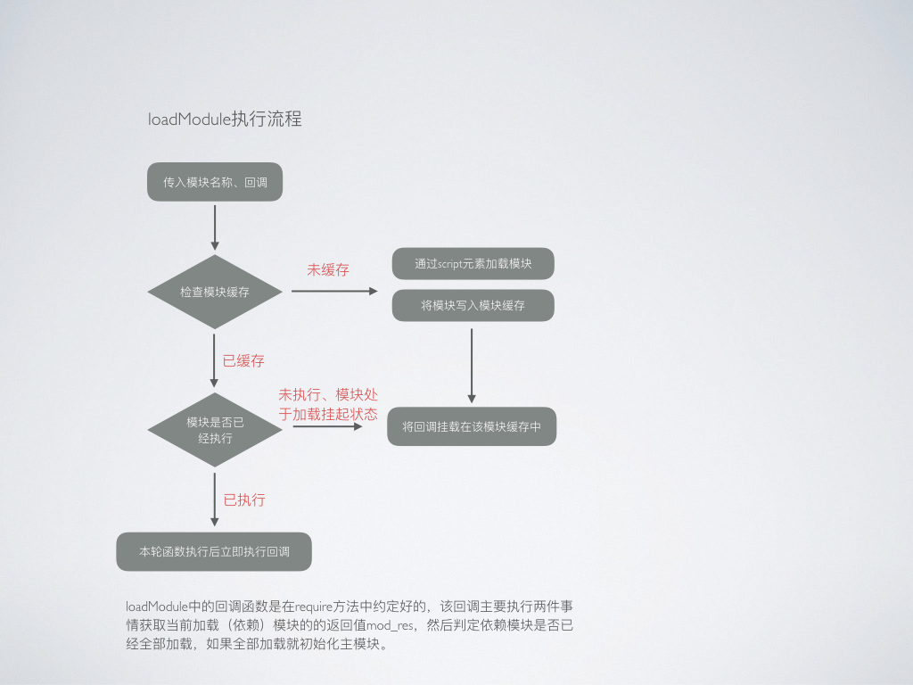
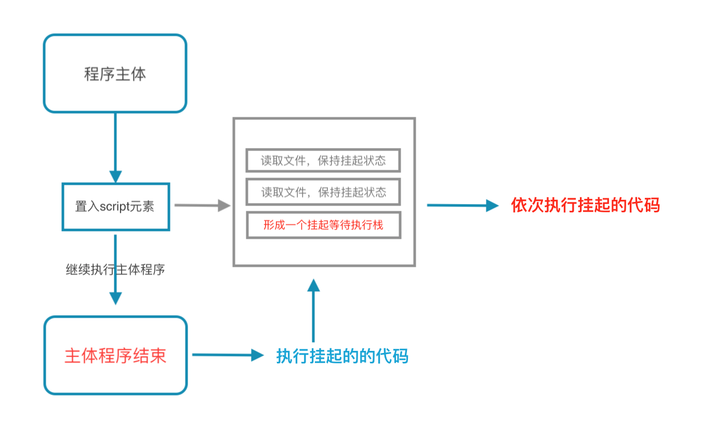
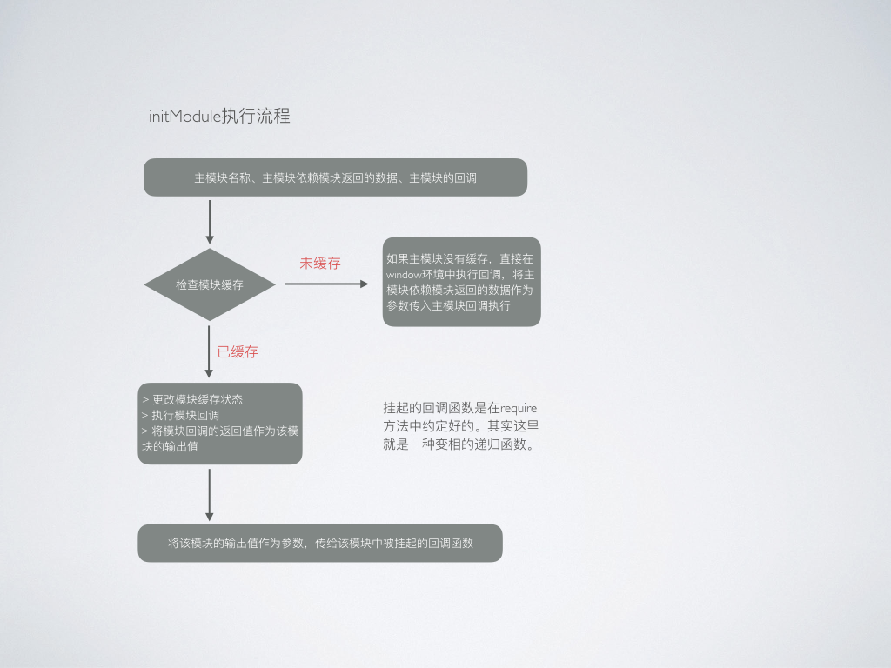

### Require模块加载时如何实现的？

说一下原生JS如何实现require的核心思想

* <h4 id="require">require()方法</h4>

require(module_deps, callback(modules_res) {});

> @module_deps: Array 记录需要依赖的模块地址 </br>
> @callback: 加载模块后执行的回调函数，该回调函数接收一组参数module_res </br>
> @module_res: 为加载模块module_deps中依次每个模块返回的值

require()方法执行流程

* **获取模块名**将当前执行代码的script元素的ID作为模块名,在该项目中我们取ID，这样更方便操作（当然也可以是地址）,通过`document.currentScript.id`方法来获取当前script标签的id,如果没有则为`require_main`,

* **检查依赖模块**检查是否需要加载其他模块，如果没有则直接传入initModule,进行当前模块的初始化，究竟[如何初始化](#initModule), 如果需要添加依赖模块，那么依次循环执行模块加载函数。

* **闭包执行模块加载**在`require`方法中有下面一段闭包函数，非常重要：
```javascript
(function (i) {
  // 记录模块依赖值
  depCount++;
  // 执行模块加载
  loadModule(modul_deps[i], function (mod_res) {
    // 将每个依赖模块的返回数据储存
    modules_res[i] = mod_res;
    // 每执行完一个模块那么将需要依赖模块的数量减一
    depCount--;
    // 当所有依赖模块以及加载完毕，那么初始化主模块
    if (depCount == 0) {
      // 初始依赖模块
      initModule(modName, modules_res, callback);
    }
  });
})(i)
```
这个闭包也是整个`require`模块最主要消耗内存的地方，依次循环加载模块依赖中，我们都需要执行`loadModule`函数，而在该函数中我们又传入了一个新的匿名函数，这个函数中需要使用使用多个`require`函数体内的变量，所以在该函数未执行前这些变量都必须保存在内存中。
那为什么要说这个闭包函数很重要呢？主要是这里面包含了整个模块加载**执行逻辑**。

* <h4 id="loadModule">loadModule()方法</h4>

我们直接看代码执行流程：



```javascript
/*
** @mod_dep_name  需要加载模块的名字
** @callback 加载模块后的回调函数，这里的回调函数已经在`require`方法中被我们写死，就是记录模块返回的数据，和检查所有依赖模块是否已经全部加载完毕，如果加载完毕就执行模块初始化
*/
let loadModule = function (mod_dep_name, callback) {
  // _getPathUrl检查模块地址是否符合要求（检查是否为一个js文件）
  let url = _getPathUrl(mod_dep_name);
  /*
  ** @js_ele 记录页面第一个引入的代码标签
  ** @_script 需要置入页面的代码标签
  ** mod_obj 储存缓存中的模块信息
  */
  let js_ele, mod_obj, _script;
  // 检查模块是否已经加载
  if (moduleCache[modName]) {

    mod_obj = moduleCache[mod_dep_name];
    // 检查模块状态
    if (mod_obj.status == 'loaded') {
      /*
      ** 如果已经加载完毕，那么下次轮询时执行回调
      ** 这里在该案例中是不会被执行的,因为整个加载策略为同步加载策略
      */
      setTimeout(callback(mod_obj.exports), 0);
    } else {
      /*
      ** 如果未加载完毕就推入事件组（其实这里一个事件栈
      ** 也就是所有的模块都将回调函数挂起，等待模块被加载后执行
      */
      mod_obj.onload.push(callback);
    }

  } else {
    // 缓存模块
    moduleCache[mod_dep_name] = {
      modName: mod_dep_name,
      status: 'loading',
      exports: null,
      onload: [callback]
    };
    // 创建script元素到文档中
    _script = document.createElement('script');
    _script.id = mod_dep_name;
    _script.type = 'text/javascript';
    _script.charset = 'utf-8';
    // 约定当前载入的代码为异步执行
    _script.async = true;
    _script.src = url;
    // 注意这里添加元素的顺序与模块依赖需求是吻合的
    js_ele = document.getElementsByTagName('script')[0];
    js_ele.parentNode.insertBefore(_script, js_ele);
    // 这段代码其实很容易理解，就是将模块写入缓存，并将模块通过script标签引入HTML文件中
  }
}
```

**需要注意的地方**

向HTML中加入`script`标签后并不会立即生效，这个跟添加普通标签不一样，这句话什么意思呢？我们可以通过`img`标签来作对比，在`img`标签中当我们给img添加src属性后，一旦将该元素置入HTML文档，那么img图片就会立即加载图片。但是在`script`标签中，在添加src属性后，将元素置入HTML文档后，此时引入的代码并不会立即执行，而是出于挂起状态，直到主程序执行完毕后再执行。

理解这点非常关键，否则就无法理解为什么上面检查模块状态是无效的（代码的挂起状态就像是假的异步执行，本质依然是同步执行）。

示例图：



关于向页面中动态添加`script`标签对代码执行顺序的影响，可以参看本案例中`test.html`文件，这个例子就能反应代码究竟是如何执行的。

* <h4 id="initModule">initModule()方法</h4>

initModule方法中有三个参数`modName`,`modules_res`,`callback`;
> @modName: 当前执行的模块名称，这里不要和依赖模块名字搞混了 </br>
> @modules_res: 当前执行模块中所有依赖模块返回的数据 </br>
> @callback: 当前执行模块的主回调函数

模块初始化流程：


